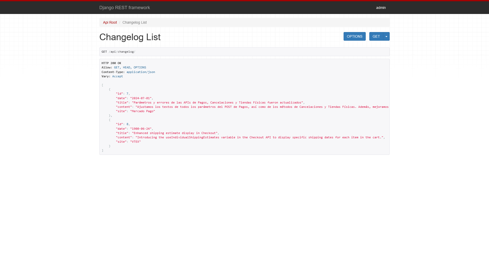
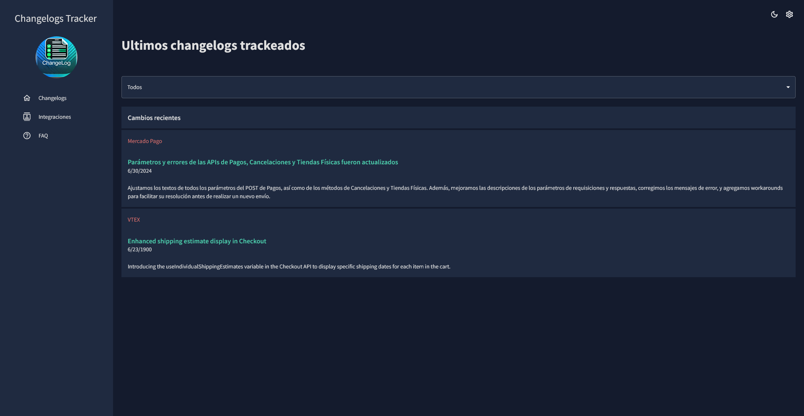

# Changelog Tracker

Este es un proyecto de seguimiento de changelogs desarrollado en Django y React. El objetivo de este proyecto es proporcionar una interfaz para rastrear los cambios de varias plataformas como Mercado Pago y VTEX. A continuación se detallan las instrucciones para configurar y ejecutar el proyecto, así como una descripción detallada de su funcionamiento.

## Características

- Rastreo automático de changelogs de diferentes sitios web.
- Almacenamiento de changelogs en una base de datos.
- Interfaz de usuario para visualizar los changelogs recientes.
- Notificaciones automáticas en Microsoft Teams para nuevos changelogs.

## Requisitos

- Python 3.8 o superior
- Node.js 14 o superior
- Django 3.2
- Docker (opcional, para despliegue)

## Ejecución con Docker (es más rapido y mejor que instalarlo)

### Ejecución con Docker

1. Construir y Ejecutar los Contenedores

En el directorio raíz del proyecto, ejecuta los siguientes comandos:

    ```
    docker-compose build
    docker-compose up
    ```
2. Inicializar la Base de Datos y Crear el Superusuario

Una vez que los contenedores estén en funcionamiento, abri una nueva terminal y ejecuta los siguientes comandos para aplicar las migraciones y crear un superusuario:

    ```
    docker-compose exec backend python manage.py migrate
    docker-compose exec backend python manage.py createsuperuser
    ```

## Instalación (Si te la queres complicar, bienvenido)

### Backend (Django)

1. Clona el repositorio:

    ```
    git clone https://github.com/jpromanonet/changelogsTracker.git
    cd changelogs_tracker/backend
    ```
2. Crea y activa un entorno virtual:

    ```
    python -m venv venv
    source venv/bin/activate  # En Windows usa `venv\\Scripts\\activate`
    ```
3. Instala las dependencias:

    ```
    pip install -r requirements.txt
    ```

4. Configura las variables de entorno:

    Crea un archivo .env en el directorio backend y añade las siguientes variables:

    ```
    SECRET_KEY=tu_clave_secreta
    DEBUG=True
    ALLOWED_HOSTS=*
    DATABASE_URL=sqlite:///db.sqlite3  # O configura tu base de datos preferida
    TEAMS_WEBHOOK_URL=tu_webhook_de_teams
    ```

5. Realiza las migraciones de la base de datos:

    ```
    python manage.py migrate
    ```

6. Carga los datos iniciales (opcional pero recomendado):

    ```
    python manage.py loaddate initial_data.json
    ```

7. Inicia el servidor de desarrollo:

    ```
    python manage.py runserver
    ```

Si todo sale bien, en http://localhost:8000/api/changelog deberias ver algo asi:



### Frontend (React)

1. Ir al directorio 'frontend'

    ```
    cd ../frontend
    ```

2. Instala las dependencias:

    ```
    npm install
    ```

3. Inicia la aplicación:

    ```
    npm start
    ```
Si todo sale bien, deberia verse esta pantalla en tu localhost:3000



## Uso

Abri tu navegador web y ve a http://localhost:3000 para acceder a la interfaz de usuario.

Accede a http://localhost:8000/admin para gestionar el backend a través de la interfaz de administración de Django.

## Notificaciones en Microsoft Teams

El sistema de notificaciones está integrado en el archivo cron.py. Cada vez que se detecta un nuevo changelog, se envía una notificación a un canal de Microsoft Teams configurado.

## Contribuciones

Las contribuciones son bienvenidas. Por favor, abre un issue o envía un pull request.

## Licencia

Este proyecto está licenciado bajo la Licencia MIT. Ver el archivo LICENSE para más detalles.
